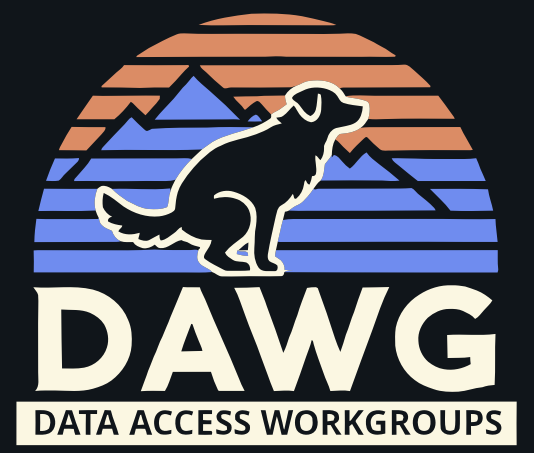

## Recommended IDE Setup

[VSCode](https://code.visualstudio.com/) + [Volar](https://marketplace.visualstudio.com/items?itemName=Vue.volar) (and disable Vetur).

## Type Support for `.vue` Imports in TS

TypeScript cannot handle type information for `.vue` imports by default, so we replace the `tsc` CLI with `vue-tsc` for type checking. In editors, we need [Volar](https://marketplace.visualstudio.com/items?itemName=Vue.volar) to make the TypeScript language service aware of `.vue` types.

## Customize configuration

See [Vite Configuration Reference](https://vitejs.dev/config/).

## Project Setup

```sh
npm install
```

### Compile and Hot-Reload for Development

```sh
npm run dev
```

### Compile and Minify for Production

```sh
npm run build
```

### Use Production Assets in Dev Testing (`workgroup:mozilla-confidential` metadata)

> [!WARNING] 
> Do not commit these files

```sh
gsutil cp gs://moz-fx-data-prot-nonprod-c3a1-protodash/dawg/static/gcpv2_merged.json public/
gsutil cp gs://moz-fx-data-prot-nonprod-c3a1-protodash/dawg/static/gcpv1_enriched.json public/
VITE_USE_PROD_DATA=true npm run dev
```

### Run End-to-End Tests with [Playwright](https://playwright.dev)

```sh
# Install browsers for the first run
npx playwright install

# Runs the end-to-end tests
npm run test:e2e

# Runs the tests in debug mode
npm run test:e2e -- --debug

# Runs the e2e tests w/ CI configuration
CI=true npm run test:e2e
```

### Lint with [ESLint](https://eslint.org/)

```sh
npm run lint
```
