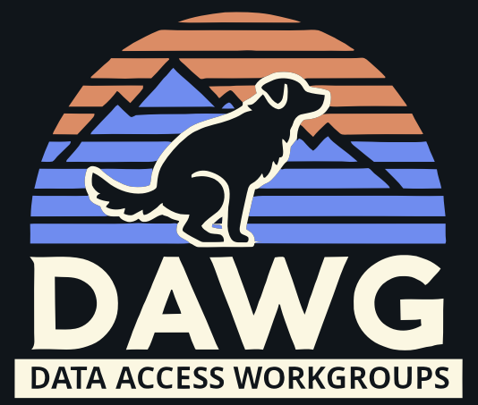

## Recommended IDE Setup

[VSCode](https://code.visualstudio.com/) + [Volar](https://marketplace.visualstudio.com/items?itemName=Vue.volar) (and disable Vetur).

## Type Support for `.vue` Imports in TS

TypeScript cannot handle type information for `.vue` imports by default, so we replace the `tsc` CLI with `vue-tsc` for type checking. In editors, we need [Volar](https://marketplace.visualstudio.com/items?itemName=Vue.volar) to make the TypeScript language service aware of `.vue` types.

## Customize configuration

See [Vite Configuration Reference](https://vitejs.dev/config/).

## Project Setup

```sh
npm install
```

### Compile and Hot-Reload for Development

```sh
npm run dev
```

## Data Sources

Workgroup data lives in two BigQuery views:

- `mozdata.mozcloud.workgroups`
- `mozdata.mozcloud.workgroup_subgroup_members`

When deployed to [Quick](https://quick.mozilla.cloud), the app queries these
directly through `quick.query`.

The source is picked at runtime, in this order:

| Condition | Source |
| --- | --- |
| `VITE_DATA_SOURCE=bigquery\|prod-ndjson\|mock` | as set — explicit override |
| Quick SDK present (served from Quick) | BigQuery |
| Production build, or `VITE_USE_PROD_DATA=true` | `public/workgroups.ndjson` |
| otherwise | `public/mock_*.ndjson` |

`npm run dev` gets mock fixtures, because `/quick.js` only resolves on a Quick
host.

### Use Production Data in Dev Testing (`workgroup:mozilla-confidential` metadata)

> [!WARNING]
> Do not commit these files

```sh
./scripts/refresh-data.sh          # pulls both views from BigQuery into public/
VITE_USE_PROD_DATA=true npm run dev
```

### Deploy to Quick

Merging to `main` deploys to <https://dawg.quick.mozilla.cloud/> via
`.github/workflows/workflows-quick.deploy.yml` (OIDC, no secrets).

**Don't run `quick deploy` locally against the real site.** It deploys under
your identity and overwrites the workflow's ownership marker. To try a build
out, use a scratch name on stage:

```sh
npm run build:quick
QUICK_ENV=stage quick deploy dist <your-username>-dawg
```

Use `build:quick`, not plain `build`. It differs from `build` in two ways:

1. It strips the `workgroup:mozilla-confidential` NDJSON that `vite build`
   copies out of `public/` if `refresh-data.sh` has been run. The deployed app
   reads BigQuery and never needs those files, so shipping a stale confidential
   snapshot would be pure downside.
2. It copies `index.html` to `404.html`. The app uses HTML5 history routing, so
   a deep link like `/workgroup/foo` must fall back to the SPA shell rather than
   returning a static 404.

### Lint with [ESLint](https://eslint.org/)

```sh
npm run lint
```

### Testing

Run all test concurrently

```sh
npm run test
```

### Run Type Tests/Checking

```sh
npm run test:types
```

#### Run Unit Tests with [Vitetest](https://vitest.dev/)

```sh
npm run test:unit
```

#### Run End-to-End Tests with [Playwright](https://playwright.dev)

```sh
# Install browsers for the first run
npx playwright install

# Runs the end-to-end tests
npm run test:e2e

# Runs the tests in debug mode
npm run test:e2e -- --debug

# Runs the e2e tests w/ CI configuration
CI=true npm run test:e2e
```

### Compile and Minify for Production

```sh
npm run build
```
